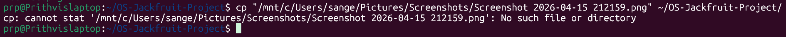

# OS Jackfruit - Container Runtime Simulation

## Output Screenshot

## Description
This project simulates a container runtime system inspired by OS Jackfruit.

## Features
- Start and stop containers
- Logging system
- Command-line execution
- Container activity tracking

## Concepts Used
- fork()
- exec()
- kill()

## How to Run
make
./engine start c1 "sleep 20"
./engine logs
