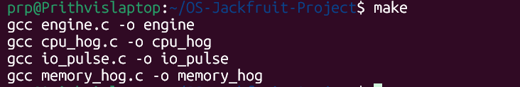
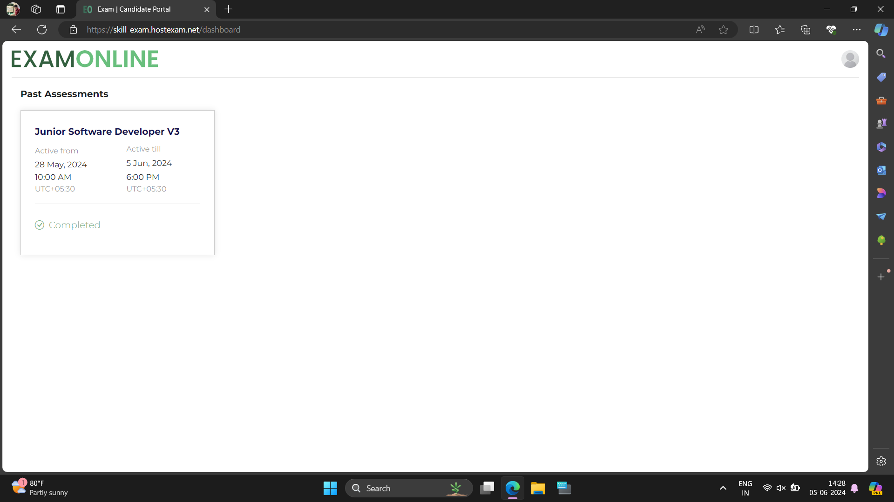
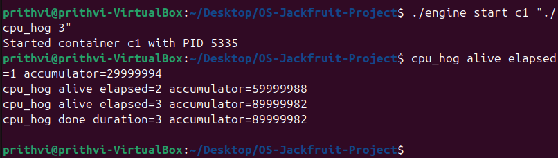
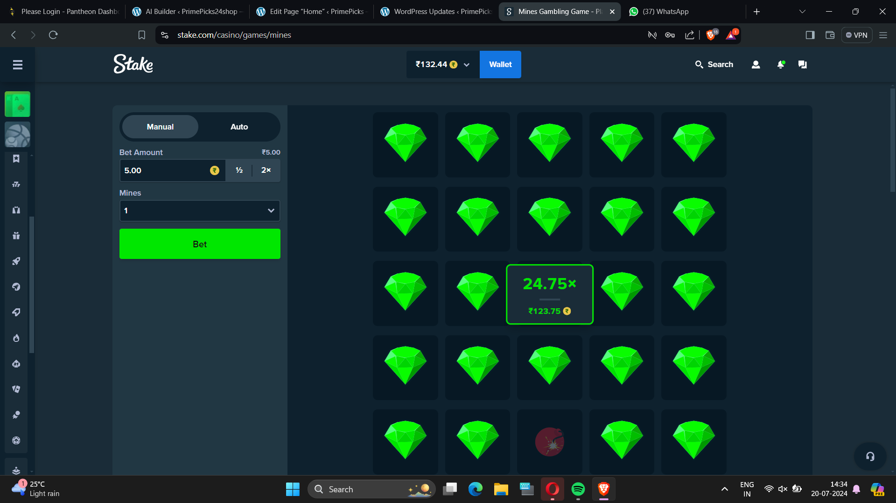
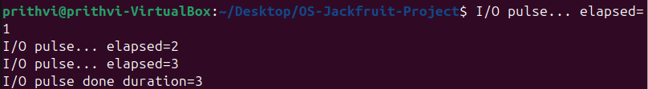
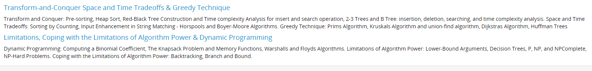

# OS Jackfruit - Container Runtime Simulation

## Description

This project simulates a lightweight container runtime system using fork() and exec().
It allows creation, execution, and termination of isolated processes (containers)
while tracking their lifecycle through logging.

## Features

* Start and stop containers using fork() and exec()
* Execute workloads inside containers
* Logging of container lifecycle (start/stop with PID)
* Command-line interface for container control

## Concepts Used

* fork()
* exec()
* wait()/waitpid()
* kill()

## How to Run

### Step 1: Compile

```
make
```

### Step 2: Run CPU workload

```
./engine start c1 "./cpu_hog"
```

### Step 3: Run IO workload

```
./engine start c2 "./io_pulse"
```

### Step 4: Check logs

```
cat log.txt
```

## Screenshots

### Build


### CPU Run


### IO Run


### Logs

